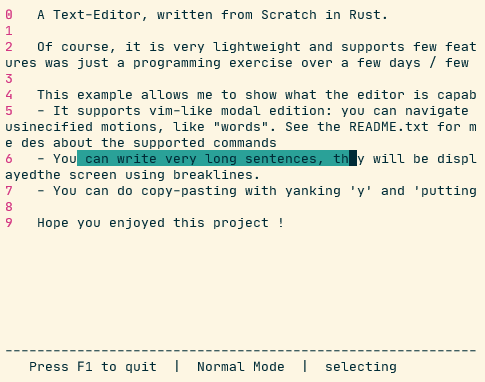

# 🟥 RED 🟥 Text Editor written in Rust

This my **built-from-scratch** text editor, in Rust. I wanted to write a text editor since a long time, here is my trial. It supports **vim-like** modal edition, and many commands that are defined by VIM.



All the code is written in Rust. It contains a model, with an abstraction for different edition modes (insert mode, normal mode, command mode, visual selection, etc...), abstraction for selection (forward, backward, words, etc) and a view. The view is written using **ncurses**, using the bindings from [this link](https://github.com/jeaye/ncurses-rs) which turned out to be very easy to use. There are also unit-tests to make sure that I do not break previous functionalities while writing new ones.

Why writing a text editor ? I wanted to test my software skills. It is surely not a very efficient text editor. But it remained a very challenging exercise and I am quite happy with the overall result, especially the architecture that I found.

To try it out, just run

```bash
cargo run -- test.txt
```

## Technical Specification

Here is all of the features that I have implemented.

- In **Insert Mode**, you can type text (like in any text editor)
- In **Normal Mode**, you can navigate across your document, select part of your documents, yank, etc...
	- currently supported keybindings (same role as vim):	
		- `w`, `b` to move the cursor 1 word forward or backward
		- `o` or `O` to go in insert mode at the line below / above
		- `x` to delete the current char
		- `r` to replace the current char
		- `f`, `F`, `;` to look for a character forward or backward and repeat the same lookup
		- `G` to go to a line number, for instance "12G" to go to line 12
- The editor supports **copy/paste** through vim's yank and put:
	- you can select a part of the document with the **visual selection**: 'v'
	- `y` will yank your visual selection
	- `p` will put you visual selection where your cursor is at
    - `u` to undo
		- This is limited to writing characters. All the framework is here to extend it to more actions. I just did not have time.
- In **Command Mode**, you can execute commands
	- currently supported: `:w` (write), `:q` (quit), `:wq` or `:x`

About the visual display:
- **Line numbers** are displayed with a status bar at the bottom
- When the line is too long, **line-wrapping** is done to fit the screen
- If the number of line is bigger than the screen, you can **navigate vertically** on your document using the arrows of the keyboard.

## A word about the model

Let's write something here ! 

## TODO

This is my personal todo list for features that I think are doable.

Two tasks that are remaining and that seem difficult to do.

- [ ] Undo 'u' and redo 'C-r'
	- This will be a lot of work... Not sure if I can do it now. 
- [ ] Searching for a pattern: '/'.
	- The difficult part will be in the view, to highlight the words. However, it was already done for the visual mode, so maybe it's not too much work.

And some quick-wins that seem easy to do.

- [ ] Yanking and pasting
	- [x] Visual mode
		- [x] Logic
		- [x] Basic view
		- [x] Advanced view (breakline)
	- [ ] yank and put
		- [x] yank current selection
		- [x] put the current yanking
		- [ ] special yanking action: 'yy'
	- [ ] Advanced selections: '()', '{}', '[]' with 'i' or 'a' words... to do
		- [ ] 'va('
		- [ ] 'ya('
- [ ] Better motion and actions
	- [ ] Special motions: 'gg', 'G', '$', '^'
	- [x] Line number moving: '155G': go to line 155
	- [x] 'f' and 'F' motions
	- [x] re-apply previous 'f' or 'F' pattern with ';'
	- [x] 'x'
	- [x] 'r'

